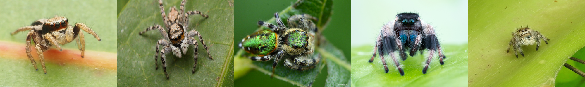

# jumping_spider_salticidae
##  Proyecto: Diversidad y distribución de arañas saltarinas (Araneae: Salticidae) en México
**Ingeniería en Ciencia de Datos, UNITEC**     
*José Eduardo Córdoba Arango*

---

### Introducción
Este proyecto tiene como objetivo analizar la diversidad y distribución de las arañas saltarinas (familia Salticidae) en México. Para ello, se utilizarán dos conjuntos de datos principales: el Catálogo mundial de arañas y el Sistema Nacional de Información sobre Biodiversidad (SNIB). Estos datos contienen información detallada sobre las especies de Salticidae, incluyendo su distribución geográfica.

---

### Objetivos y Tareas
* **Cargar y procesar los datos:** Importar los datos de los catálogos mencionados y prepararlos para su análisis.
* **Análisis exploratorio de datos:** Realizar un análisis estadístico descriptivo de los datos para obtener una visión general de la diversidad de especies, su distribución geográfica y otras características relevantes.
* **Modelado de datos:** Utilizar técnicas de modelado para identificar patrones y relaciones entre las variables. Por ejemplo, se podría analizar la relación entre la diversidad de especies y factores ambientales como la altitud o el tipo de vegetación.

---

### Carga y preprocesamiento de datos
Se descargaron los siguientes conjuntos de datos:
* **Catálogo mundial de arañas:** versión 27 ([world_spider_catalog_20260209.csv](data/raw/world_spider_catalog_20260209.csv))
* **SNIB:** registros de ejemplares de la familia Salticidae en México ([salticidae_mexico_conabio.csv](data/raw/salticidae_mexico_conabio.csv))

Los datos fueron limpiados y formateados para su posterior análisis en Python.

---

### Referencias
World Spider Catalog 2026. World Spider Catalog. Version 27. Natural History Museum Bern, online at http://wsc.nmbe.ch, accessed on February 9, 2026. doi: 10.24436/2

CONABIO. 2024. Sistema Nacional de Información sobre Biodiversidad. Registros de ejemplares. Comisión Nacional para el Conocimiento y Uso de la Biodiversidad. Ciudad de México, México.