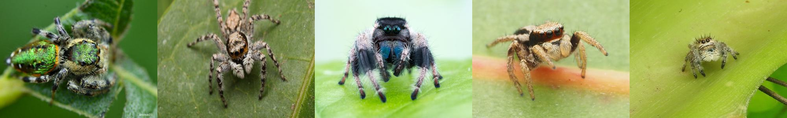

# jumping_spider_salticidae
## 🚀 Proyecto: Diversidad y distribución de las arañas saltarinas (Araneae: Salticidae) en México
**Ingeniería en Ciencia de Datos, UNITEC**     
*José Eduardo Cordoba Arango*

---

### Introducción
Este proyecto está basado en:

- Datos sobre el [catálogo mundial de arañas](https://wsc.nmbe.ch/).
- Datos sobre el registros de ejemplares, de lafamilia Salticidae del [Sistema Nacional de Información sobre Biodiversidad](https://www.snib.mx/ejemplares/descarga/version/?v=201807) de CONABIO.

cada uno de los cuales incluye información sobre la familia, genero, especie, subespeci, año de registro, distribución y autor.

En el caso del segunod conjunto de datos, se encuentra informacion relacionada a datos geograficos, tanto estados y municipios.

---

### Objetivos y Tareas

- Cargar los datos en un modelo de base de datos relacional.

- Realizar un análisis exploratorio de dato con el fin de obtener estadísticas sobre los datos obtenidos.

- Conectar la base de datos con __Python__ sobre su herramienta __Jupyter Notebooks__ para realizar labores un analisis de

---

### Carga y preprocesamiento de datos

Se descargo el catalogo de World Spider Catalog, la version 25.5, y el Sistema Nacional de Información sobre Biodiversidad (registros de ejemplares).

Se contó inicialmente con los siguientes conjuntos de datos:

- [world_spider_catalog_v25_5.csv](datasets/world_spider_catalog_v25_5.cdv)
- [salticidae_mexico_conabio.csv](datasets/salticidae_mexico_conabio.csv)

---

### Referencia

World Spider Catalog (2025). World Spider Catalog. Version 25.5. Natural History Museum Bern, online at http://wsc.nmbe.ch, accessed on {date of access}. doi: 10.24436/2

CONABIO. 2024. Sistema Nacional de Información sobre Biodiversidad. Registros de ejemplares. Comisión Nacional para el Conocimiento y Uso de la Biodiversidad. Ciudad de México, México.
